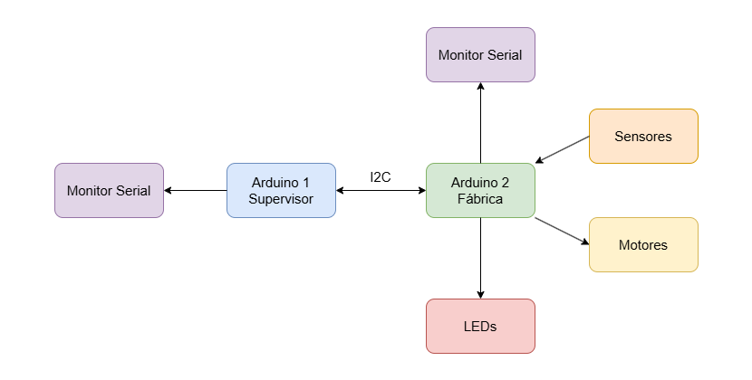

# TEC470 - SISTEMAS EMBARCADOS
Problema 2 da disciplina de Sistemas Embarcados - Controle de Planta Industrial.

## Introdução
O sistema de controle industrial do projeto prevê a automatização do funcionamento de um processo industrial de corte de blocos de madeira padronizados, por meio de serras elétricas automatizadas que cortam a madeira enquanto ela passa pela esteira.

## Produto a ser desenvolvido
O problema proposto é um controle de uma planta industrial que deve ser desenvolvido tanto em simulador quando em hardware físico, utilizando o Arduino Nano programado em linguagem C a nível de registrador, além disso, o projeto deve possuir as seguinte funcionalidades:

### Arduino 1 (Supervisor)
- Um interruptor ligado ao pino de interrupção externa, enviando uma mensagem solicitando a parada da fábrica;
- Dois potenciômetros, cada um responsável por controlar a velocidade de um dos motores na fábrica;
- A comunicação deve ser feita através de um dos protocolos já existentes no Arduino;
- Devem ser exibidas as informações recebidas da fábrica pelo supervisor no monitor serial:
    - Status do Sensor de Temperatura;
    - Status do Sensor de Inclinação;
    - Status do Sensor de Presença;
    - Status do Nível do Tanque de Óleo;
    - Status da Produção
    - Velocidade dos motores;
    - Quantidade de Blocos de madeiras cortados;

### Arduino 2 (Chão de Fábrica)
- Receber solicitação de parada do supervisor, parar a fábrica e enviar uma mensagem de confirmação de parada;
- Um interruptor ligado ao pino de interrupção externa, que caso acionado, deve parar a fábrica e enviar uma mensagem ao supervisor avisando que ocorreu uma parada;
- Sensor de temperatura com faixa de operação entre 10ºC e 40ºC, caso seja detectada uma tempertura fora dessa faixa, deve parar a produção, acender o LED vermelho e avisar o supervisor;
- Sensor de inclinação, que caso esteja fora da inclinação correta, deverá acionar um servo motor, até que a posição esteja correta, além de avisar o supervisor;
- Dois motores, ambos com as velocidades controladas pelos potenciômetros do Arduino 1;
- Dois displays de 7 segmentos e/ou LCD mostrando a contagem dos blocos cortados;
- Os motores só estarão ligados caso o Sensor de Presença não detecte a presença humana;
- Enquanto a produção estiver ocorrendo de forma prevista, o LED verde deverá ficar acesso;
- O sensor de nível deverá verificar periodicamente o nível do tanque de óleo, avisando caso esteja em nível muito baixo ou muito alto.

## Solução desenvolvida
### Especificações de Desenvolvimento
- Linguagem: C a nível de registrador;
- Bibliotecas utilizadas: Wire.h e avr.h;
- Protocolo de Comunicação: I2C;
- Ambiente de desenvolvimento: Arduino IDE;

### Recursos utilizados
- 2x Arduino Nano ATmega328p: Microcontroladores para supervisor e chão de fábrica ;
- 2x Potênciometro para controle de velocidade dos motores;
- 2x Botão para interrupção externa;
- Sensor de temperatura;
- 1x Potenciômetro (Sensor de inclinação);
- 1x Potenciômetro (Sensor de nível); 
- 1x Fotoresistor (Sensor de presença);
- 3x LED (Vermelho e Verde para controle da fábrica e Amarelo para motor de correção inclinação);
- 2x Motor CC

### Diagrama geral do sistema

- **Figura 1:** *Diagrama geral do funcionamento do do sistema.*

### Arquitetura geral do sistema

O sistema inicia com a comunicação entre as duas partes, supervisor e fábrica, feita via I2C onde o supervisor funciona como o Mestre e a fábrica como o Escravo.
...............

### Pinos utilizados
#### Supervisor
| Recurso                 | Pino       | 
| ----------------------- | ---------- |
| POTENCIOMENTRO1(ADC0)   | A0         |
| POTENCIOMENTRO2(ADC1)   | A1         |
| SDA(I2C)                | A4         |
| SDL(I2C)                | A5         |
| BOTÃO                   | D12        |

#### Fábrica
| Recurso                 | Pino       | 
| ----------------------- | ---------- |
|MOTOR 1                  |	D5         | 
|MOTOR 2                  |	D6         |
|SENSOR DE PRESENÇA	      | A0         |
|SENSOR DE TEMPERATURA    |	A1         |
|SENSOR DE INCLINAÇÃO     |	A2         |
|SENSOR DE NÍVEL	      | A3         |
|SDA(I2C)	              | A4         |
|SDL(I2C)                 |	A5         |
|MOTOR DE INCLINAÇÃO(LED) | D7         |
|LED VERDE                | D8         |
|LED VERMELHO             |	D9         |
|BOTÃO                    |	D12        |
 		
## Simulação

